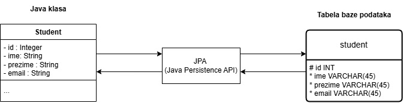

# Razvoj relacione baze podataka pomoću Spring Boot JPA

ELFAK-MAS - Napredno Softversko Inzenjerstvo

Spring Boot JPA omogućava razvoj relacione baze podataka bez potrebe za ručnim pisanjem SQL koda.
Ovo se postiže zahvaljujući ORM-u (_Object-Relational Mapping_) i drugih alata koje Spring Data JPA pruža.

Spring Boot JPA značajno olakšava rad sa bazama podataka u većini slučajeva, međutim ukoliko je potrebno
postoji fleksibilnost korišćenja SQL upita kada je to neophodno.

# Sadrzaj:

- [Uvod](#uvod)
  - [Mapiranje klase u tabelu](#mapiranje-klase-u-tabelu)
  - [JPQL (Java Persistence Query Language)](#jpql-java-persistence-query-language)
- [Opis aplikacije](#opis-aplikacije)
  - [Koji se problem rešava](#koji-se-problem-rešava)
  - [Funkcionalnosti aplikacije](#funkcionalnosti-aplikacije)
  - [Ključne komponente aplikacije](#ključne-komponente-aplikacije)
    - [pom.xml fajl](#pomxml-fajl)
    - [application.properties fajl](#applicationproperties-fajl)
    - [Entiteti i relacije](#entiteti-i-relacije)
      - [Jedan-Prema-Jedan relacija](#jedan-prema-jedan-relacija)
      - [Jedan-Prema-Više relacija](#jedan-prema-više-relacija)
- [Prednosti i mane](#prednosti-i-mane)
- [Instalacija i pokretanje](#instalacija-i-pokretanje)
  - [Povezivanje sa bazom podataka](#povezivanje-sa-bazom-podataka)

# Uvod

## Mapiranje klase u tabelu

Mapiranje Java klase u tabelu baze podataka putem __JPA__ (_Java Persistence API_) omogućava povezivanje
objekata u aplikaciji sa tabelama u relacionoj bazi podataka. Ova funkcionalnost se postiže pomoću JPA
anotacija koje definišu kako se entitet (klasa) mapira u tabelu, a njeni atributi na kolone te tabele.

<p align="center">

</p>

Mapiranjem klase u tabelu putem JPA ostvaruje se čistiji i čitljiviji kod, automatsko generisanje SQL upita,
lako upravljanje relacijama između entiteta, podrška za različite baze podataka bez promene izvornog koda, ...

## JPQL (Java Persistence Query Language)

JPQL predstavlja JPA verziju SQL-a koja radi sa entitetima, a ne direktno sa tabelama.

JPQL je jezik upita koji se koristi u okviru JPA i pruža veću apstrakciju, čineći aplikacije nezavisnim od
određene baze podataka. Iako po sintaksi dosta podseća na SQL, potrebno je shvatiti da neke funkcionalnosti
nisu dostupne kao što je na primer INSERT upit. 

Veoma moćan alat za rad sa podacima u JPA koji omogućava razvijanje aplikacije na višem nivou apstrakcije. 
Njegova snaga leži u integraciji sa objektno-orijentisanim modelom, dok istovremeno omogućava
efikasan rad sa relacionim bazama podataka.

# Opis aplikacije

Ovaj projekat predstavlja osnovu za razumevanje kako moderne tehnologije poput Spring Boot JPA pojednostavljuje
rad sa relacionim bazama podataka i omogućava brz razvoj skalabilnih aplikacija.

Mogućnost automatskog mapiranja Java klasa u tabele baze podataka, bez potrebe za ručnim pisanjem SQL upita, 
dosta pojednostavljuje razvoj bilo koje relacione baze podataka.

Ciljevi projekta su: 
- Demonstracija razvoja relacione baze podataka kroz moderan Java kod,
- Praktičan primer implementacije ORM (_Object-Relational Mapping_) koncepta,
- Olakšano upravljanje podacija u aplikacijama sa složenim relacijama.

U daljem radu je predstavljeno kako se razvija baza podataka koja se odnosi na studente, njihove podatke, kurseve,
instruktore/profesore, kao i njihove medjusobne relacije kojima se upravlja pomoću Java programskog jezika.

## Koji se problem rešava

Jedan od glavnih problema koji se reševa je smanjenje kompleknosti rada sa relacionim bazama podataka jer se
izbegava pisanje ručnih SQL upita i kodova. Ovo se rešava pomoću ORM (_Object-Relational Mapping_) koji
automatski mapira Java klase u tabele baze podataka.

Ručno pisanje koda za osnovne operacije (Create, Read, Update, Delete) je repetitivno i neefikasno.
Spring Boot JPA nudi gotove metode kroz repozitorijume koji su dosta fleksibilni i efikasni.

Pisanje složenih SQL upita je često teško i zahteva duboko razumevanje SQL. Spring Boot JPA nam omogućava
pisanje upita koristeći __JPQL__ (_eng. Java Persistence Query Language_) koji se zasnivaju na Javi i baziraju 
na entitetima.

Kao glavni problem je komplikovano upravljanje relacijama između tabela, rad sa relacionim bazama podataka
uključuje upravljanje složenim odnosima između njih. Spring Boot JPA nam omogućuje jednostavno definisanje 
različitih relacija pomoću dostupnih anotacija.

## Funkcionalnosti aplikacije

Ključne karakteristike aplikacije su:

- __Automatizacija mapiranja objekta i tabela__
  
  (Ostvaruje se korišćenjem anotacija poput `@Entity`, `@Table`, `@Column` koje definišu strukturu
  baze podataka kroz Java klase),

- __Upravljanje podatacima bez direktnog SQL koda__
  
  (Spring Boot JPA omogućava jednostavne CRUD operacije kroz repozitorijume i metode, uz mogućnosti
   definisanje složenih upita),

- __Podrška za relacione odnose__

  (Aplikacije implementira različite tipove odnosa između entiteta, uključujući:
  - Jedan prema jedan - `@OneToOne`,
  - Jedan prema više - `@OneToMany`,
  - Više prema više - `@ManyToMany`
  ),

- __Automatsko generisanje i migracija šeme baze podataka__

  (Konfiguracija omogućava generisanje šeme baze podataka ili njeno ažuriranje na osnovu definicija entiteta,
  uz opcije poput `spring.jpa.hibernate.ddl-auto=update`),

- __Fleksibilno definisanje upita__

  (Pored osnovnih metoda, aplikacije podržava JPQL, Nativne SQL upite)

- __Praktična integracija sa bazama podataka__

  (Aplikacije može koristiti različite baze podataka, uključujući MySQL, PostgreSQL i druge uz jednostavnu
  konfiguraciju u `application.properties` datoteci).

## Ključne komponente aplikacije

### pom.xml fajl

Upravljanje projektom i njegovim zavisnostima (_eng. dependencies_) se vrši korišćenjem Maven-a. 
Maven uz pomoć pom.xml fajla u pozadini preuzima potrebne biblioteke, konfiguriše projektne plugine
i postavlja osnovne parametre projekta.

(pom.xml se može zamisliti kao "_naša lista za kupovinu_").

Struktura pom.xml fajla:
- Meta podaci projekta - Ime projekta, verzija, vrsta izlaznog fajla (JAR, WAR, ...),
- Zavisnosti (_eng. Dependencies_) - Lista projekata od kojih zavisimo (Spring, JPA, Web, ...),
- Dodaci (_eng. Plugins_) - Dodatni prilagođeni zadaci za pokretanje (Generisanje izveštaja o JUnit testovima, ...).

Za dodavanje nove zavisnosti, potrebno je definisati tzv. _GAV_ (Group Id, Artifact ID, Version)

### application.properties fajl

Konfiguracioni fajl u svim Spring Boot aplikacijama koji se koristi za definisanje raznih parametara potrebnih
za pokretanje aplikacije i njeno ponašanje. On omogućava lako prilagođavanje aplikacije bez menjanja njenog
izvornog koda.

Kao jedne od osnovnih konfiguracija su:
- Podešavanje servera (Port aplikacije),
- Konekcija sa bazom podataka,
- JPA konfiguracija.

### Entiteti i relacije

#### Jedan-Prema-Jedan relacija

Glavni entiteti: 
- student,
- students_details.

Sledeća slika prikazuje relaciju jedan-prema-jedan (_eng. one-to-one_) između entiteta students i students_details.
Kao osnovna anotacija koja omogućava ovu relaciju je `@OneToOne` koja je prikazana u kodu ispod.

<p align="center">
  
</p>

- __Student klasa__

```java
@Entity
@Table(name = "students")
public class Student {

    @Id
    @GeneratedValue(strategy = GenerationType.IDENTITY)
    @Column(name = "id")
    private Integer id;

    @Column(name = "firstName", nullable = false)
    private String firstName;

    @Column(name = "lastName", nullable = false)
    private String lastName;

    @OneToOne(mappedBy = "student", cascade = CascadeType.ALL)
    private StudentDetails studentDetails;
    
    // ...
}
```

- __Detalji studenta__

```java
@Entity
@Table(name = "students_details")
public class StudentDetails {

    @Id
    @GeneratedValue(strategy = GenerationType.IDENTITY)
    @Column(name = "id")
    private Integer id;

    @Column(name = "email", nullable = false)
    private String email;

    @Column(name = "address", nullable = true)
    private String address;

    @OneToOne(cascade = {CascadeType.DETACH, CascadeType.MERGE, CascadeType.PERSIST, CascadeType.REFRESH})
    @JoinColumn(name = "student_id", nullable = false)
    private Student student;

    // ...
}
```

#### Jedan-Prema-Više relacija


# Prednosti i mane


# Instalacija i pokretanje


## spring initialirz


## Povezivanje sa bazom podataka

```properties
spring.datasource.url=jdbc:mysql://localhost:3306/fakultet
spring.datasource.username=springstudent
spring.datasource.password=springstudent
```
