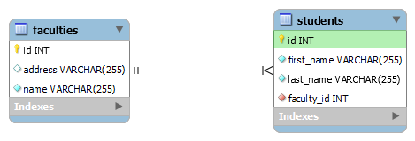
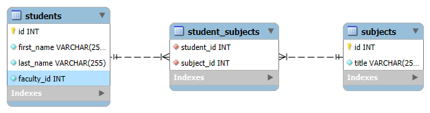
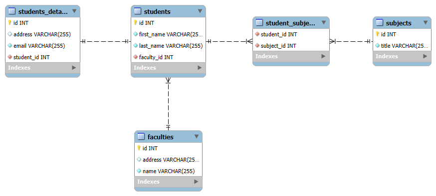

# Razvoj relacione baze podataka pomoću Spring Boot JPA

ELFAK-MAS - Napredno Softversko Inzenjerstvo

Spring Boot JPA omogućava razvoj relacione baze podataka bez potrebe za ručnim pisanjem SQL koda.
Ovo se postiže zahvaljujući ORM-u (_Object-Relational Mapping_) i drugih alata koje Spring Data JPA pruža.

Spring Boot JPA značajno olakšava rad sa bazama podataka u većini slučajeva, međutim ukoliko je potrebno;
postoji fleksibilnost korišćenja SQL upita kada je to neophodno.

# Sadrzaj:

- [Uvod](#uvod)
  - [Mapiranje klase u tabelu](#mapiranje-klase-u-tabelu)
  - [JPQL (Jakarta Persistence Query Language)](#jpql-jakarta-persistence-query-language)
- [Opis aplikacije](#opis-aplikacije)
  - [Koji se problem rešava](#koji-se-problem-rešava)
  - [Funkcionalnosti aplikacije](#funkcionalnosti-aplikacije)
  - [Ključne komponente aplikacije](#ključne-komponente-aplikacije)
    - [pom.xml fajl](#pomxml-fajl)
    - [application.properties fajl](#applicationproperties-fajl)
    - [Entiteti i relacije](#entiteti-i-relacije)
      - [Jedan-Prema-Jedan relacija](#jedan-prema-jedan-relacija)
      - [Jedan-Prema-Više relacija](#jedan-prema-više-relacija)
      - [Više-Prema-Više relacija](#više-prema-više-relacija)
  - [Projekat](#projekat)
- [Prednosti i mane](#prednosti-i-mane)
- [Instalacija i pokretanje](#instalacija-i-pokretanje)
  - [Spring Initializr](#spring-initializr)
    - [Konfiguracija Maven zavisnosti](#konfiguracija-maven-zavisnosti)
  - [Povezivanje sa bazom podataka](#povezivanje-sa-bazom-podataka)
  - [Pokretanje](#pokretanje)

# Uvod

## Mapiranje klase u tabelu

Mapiranje Java klase u tabelu baze podataka putem __JPA__ (_Jakarta Persistence API_) omogućava povezivanje
objekata u aplikaciji sa tabelama u relacionoj bazi podataka. Ova funkcionalnost se postiže pomoću JPA
anotacija koje definišu kako se entitet (klasa) mapira u tabelu, a njeni atributi na kolone te tabele.

<p align="center">

</p>

Mapiranjem klase u tabelu putem JPA ostvaruje se čistiji i čitljiviji kod, automatsko generisanje SQL upita,
lako upravljanje relacijama između entiteta, podrška za različite baze podataka bez promene izvornog koda, ...

## JPQL (Jakarta Persistence Query Language)

JPQL predstavlja JPA verziju SQL-a koja radi sa entitetima, a ne direktno sa tabelama.

JPQL je jezik upita koji se koristi u okviru JPA i pruža veću apstrakciju, čineći aplikacije nezavisnim od
određene baze podataka. Iako po sintaksi dosta podseća na SQL, potrebno je shvatiti da neke funkcionalnosti
nisu dostupne kao što je na primer INSERT upit. 

Veoma moćan alat za rad sa podacima u JPA koji omogućava razvijanje aplikacije na višem nivou apstrakcije. 
Njegova snaga leži u integraciji sa objektno-orijentisanim modelom, dok istovremeno omogućava
efikasan rad sa relacionim bazama podataka.

# Opis aplikacije

Ovaj projekat predstavlja osnovu za razumevanje kako moderne tehnologije poput Spring Boot JPA pojednostavljuju
rad sa relacionim bazama podataka i omogućava brz razvoj skalabilnih aplikacija.

Mogućnost automatskog mapiranja Java klasa u tabele baze podataka, bez potrebe za ručnim pisanjem SQL upita, 
dosta pojednostavljuje razvoj bilo koje relacione baze podataka.

Ciljevi projekta su: 
- Demonstracija razvoja relacione baze podataka kroz moderan Java kod,
- Praktičan primer implementacije ORM (_Object-Relational Mapping_) koncepta,
- Olakšano upravljanje podacija u aplikacijama sa složenim relacijama.

U daljem radu je predstavljeno kako se razvija baza podataka koja se odnosi na studente, njihove podatke, kurseve,
instruktore/profesore, kao i njihove medjusobne relacije kojima se upravlja pomoću Java programskog jezika.

## Koji se problem rešava

Jedan od glavnih problema koji se reševa je smanjenje kompleksnosti rada sa relacionim bazama podataka jer se
izbegava pisanje ručnih SQL upita i kodova. Ovo se rešava pomoću ORM (_Object-Relational Mapping_) koji
automatski mapira Java klase u tabele baze podataka.

Ručno pisanje koda za osnovne operacije (Create, Read, Update, Delete) je repetitivno i neefikasno.
Spring Boot JPA nudi gotove metode kroz repozitorijume koji su dosta fleksibilni i efikasni.

Pisanje složenih SQL upita je često teško i zahteva duboko razumevanje SQL. Spring Boot JPA nam omogućava
pisanje upita koristeći __JPQL__ (_eng. Jakarta Persistence Query Language_) koji se zasnivaju na Javi i baziraju 
na entitetima.

Kao glavni problem je komplikovano upravljanje relacijama između tabela, rad sa relacionim bazama podataka
uključuje upravljanje složenim odnosima između njih. Spring Boot JPA nam omogućuje jednostavno definisanje 
različitih relacija pomoću dostupnih anotacija.

## Funkcionalnosti aplikacije

Ključne karakteristike aplikacije su:

- __Automatizacija mapiranja objekta i tabela__
  
  (Ostvaruje se korišćenjem anotacija poput `@Entity`, `@Table`, `@Column` koje definišu strukturu
  baze podataka kroz Java klase),

- __Upravljanje podatacima bez direktnog SQL koda__
  
  (Spring Boot JPA omogućava jednostavne CRUD operacije kroz repozitorijume i metode, uz mogućnosti
   definisanje složenih upita),

- __Podrška za relacione odnose__

  (Aplikacije implementira različite tipove odnosa između entiteta, uključujući:
  - Jedan prema jedan - `@OneToOne`,
  - Jedan prema više - `@OneToMany`,
  - Više prema više - `@ManyToMany`
  ),

- __Automatsko generisanje i migracija šeme baze podataka__

  (Konfiguracija omogućava generisanje šeme baze podataka ili njeno ažuriranje na osnovu definicija entiteta,
  uz opcije poput `spring.jpa.hibernate.ddl-auto=update`),

- __Fleksibilno definisanje upita__

  (Pored osnovnih metoda, aplikacije podržava JPQL, Nativne SQL upite)

- __Praktična integracija sa bazama podataka__

  (Aplikacije može koristiti različite baze podataka, uključujući MySQL, PostgreSQL i druge uz jednostavnu
  konfiguraciju u `application.properties` datoteci).

## Ključne komponente aplikacije

### pom.xml fajl

Upravljanje projektom i njegovim zavisnostima (_eng. dependencies_) se vrši korišćenjem Maven-a. 
Maven uz pomoć pom.xml fajla u pozadini preuzima potrebne biblioteke, konfiguriše projektne plugine
i postavlja osnovne parametre projekta.

(pom.xml se može zamisliti kao "_naša lista za kupovinu_").

Struktura pom.xml fajla:
- Meta podaci projekta - Ime projekta, verzija, vrsta izlaznog fajla (JAR, WAR, ...),
- Zavisnosti (_eng. Dependencies_) - Lista projekata od kojih zavisimo (Spring, JPA, Web, ...),
- Dodaci (_eng. Plugins_) - Dodatni prilagođeni zadaci za pokretanje (Generisanje izveštaja o JUnit testovima, ...).

Za dodavanje nove zavisnosti, potrebno je definisati tzv. _GAV_ (Group Id, Artifact ID, Version)

### application.properties fajl

Konfiguracioni fajl u svim Spring Boot aplikacijama koji se koristi za definisanje raznih parametara potrebnih
za pokretanje aplikacije i njeno ponašanje. On omogućava lako prilagođavanje aplikacije bez menjanja njenog
izvornog koda.

Kao jedne od osnovnih konfiguracija su:
- Podešavanje servera (Port aplikacije),
- Konekcija sa bazom podataka,
- JPA konfiguracija.

### Entiteti i relacije

Pre razvoja aplikacije potrebno je razumeti proces kaskadiranja (_eng. Cascade_). Kaskadiranje definiše
kako će se određene operacije na roditeljskom entitetu automatski primeniti na njegove povezane entitete.

Primer: Ukoliko se sačuva student i njegovi detalji u bazu, a `CascadeType.PERSIST` je omogućeno, oba
entiteta će automatski biti sačuvana.

Tipovi kaskadiranja (_eng. Cascade Types_):

| Cascade Type | Opis                                                                           |
|--------------|--------------------------------------------------------------------------------|
| Detach       | Kada se entitet odvoji (ne nalazi se u sesiji), odvojiće se i povezani entitet |
| Merge        | Kada se entitet ažurira, ažuriraće se i povezani entitet                       |
| Persist      | Kada se entitet sačuva, sačuvaće se i povezani entitet                         |
| Remove       | Kada se entitet obriše, obrisaće se i povezani entitet                         |
| Refresh      | Kada se entitet "osveži" iz baze, osvežiće se i povezani entitet               |
| All          | Primenjuje se sve gore navedene operacije                                      |

#### Jedan-Prema-Jedan relacija

Glavni entiteti: 
- student,
- students_details.

Sledeća slika prikazuje relaciju jedan-prema-jedan (_eng. one-to-one_) između entiteta students i students_details.
Kao osnovna anotacija koja omogućava ovu relaciju je `@OneToOne` koja je prikazana u kodu ispod.

<p align="center">
  
</p>

- __Student klasa__:

```java
@Entity
@Table(name = "students")
public class Student {

    @Id
    @GeneratedValue(strategy = GenerationType.IDENTITY)
    @Column(name = "id")
    private Integer id;

    @Column(name = "firstName", nullable = false)
    private String firstName;

    @Column(name = "lastName", nullable = false)
    private String lastName;

    @OneToOne(mappedBy = "student", cascade = CascadeType.ALL)
    private StudentDetails studentDetails;
    
    // ...
}
```

- __Detalji studenta (_eng. Student Details_) klasa__:

```java
@Entity
@Table(name = "students_details")
public class StudentDetails {

    @Id
    @GeneratedValue(strategy = GenerationType.IDENTITY)
    @Column(name = "id")
    private Integer id;

    @Column(name = "email", nullable = false)
    private String email;

    @Column(name = "address", nullable = true)
    private String address;

    @OneToOne(cascade = {
            CascadeType.DETACH, 
            CascadeType.MERGE, 
            CascadeType.PERSIST, CascadeType.REFRESH
    })
    @JoinColumn(name = "student_id", nullable = false)
    private Student student;

    // ...
}
```

#### Jedan-Prema-Više relacija

Glavni entiteti:
- student,
- faculty.

Sledeća slika prikazuje relaciju jedan-prema-više (_eng. one-to-many_) između entiteta students i faculties.
Kao osnovne anotacije koje omogućavaju ovu relaciju su `@OneToMany` i `@ManyToOne` koje su prikazane u kodu ispod.

<p align="center">
  
</p>

- __Student klasa__:

```java
@Entity
@Table(name = "students")
public class Student {

    @Id
    @GeneratedValue(strategy = GenerationType.IDENTITY)
    @Column(name = "id")
    private Integer id;

    @Column(name = "firstName", nullable = false)
    private String firstName;

    @Column(name = "lastName", nullable = false)
    private String lastName;

    @ManyToOne(cascade = {
            CascadeType.DETACH,
            CascadeType.MERGE,
            CascadeType.PERSIST,
            CascadeType.REFRESH
    })
    @JoinColumn(name = "faculty_id", nullable = false)
    private Faculty faculty;
    
    // ...

}
```

- __Fakultet (_eng. Faculty_) klasa__:

```java
@Entity
@Table(name = "faculties")
public class Faculty {

    @Id
    @GeneratedValue(strategy = GenerationType.IDENTITY)
    @Column(name = "id")
    private Integer id;


    @Column(name = "name", nullable = false)
    private String name;

    @Column(name = "address")
    private String address;

    @OneToMany(mappedBy = "faculty", cascade = CascadeType.ALL)
    private List<Student> students;
    
    // ...
}
```

#### Više-Prema-Više relacija

Glavni entiteti:
- student,
- subject.

Sledeća slika prikazuje relaciju više-prema-više (_eng. many-to-many_) između entiteta students i subjects.
Kao osnovna anotacija koja omogućava ovu relaciju je `@ManyToMany` koja je prikazana u kodu ispod.

<p align="center">
  
</p>

- __Student klasa__:
```java
@Entity
@Table(name = "students")
public class Student {

    @Id
    @GeneratedValue(strategy = GenerationType.IDENTITY)
    @Column(name = "id")
    private Integer id;

    @Column(name = "firstName", nullable = false)
    private String firstName;

    @Column(name = "lastName", nullable = false)
    private String lastName;

    @ManyToMany(cascade = {
            CascadeType.DETACH,
            CascadeType.MERGE,
            CascadeType.PERSIST,
            CascadeType.REFRESH
    })
    @JoinTable(
            name = "student_subjects",
            joinColumns = @JoinColumn(name = "student_id"),
            inverseJoinColumns = @JoinColumn(name = "subject_id")
    )
    private List<Subject> subjects;
    
    // ...

}
```

- __Predmet (_eng. Subject_) klasa__:
```java
@Entity
@Table(name = "subjects")
public class Subject {

    @Id
    @GeneratedValue(strategy = GenerationType.IDENTITY)
    @Column(name = "id")
    private Integer id;

    @Column(name = "title", nullable = false)
    private String title;

    @ManyToMany(mappedBy = "subjects")
    private List<Student> students;

    // ...
}
```

## Projekat

Kada se sve prethodno sumira, dobijamo jednostavnu relacionu bazu:

<p align="center">
  
</p>

# Prednosti i mane

- PREDNOSTI:
  - __Smanjenje šablonskog koda__: Smanjuje se potreba za konfiguracijom
    standardnog koda kroz anotacija i razumne podrazumevane vrednosti,
  - __Automatska konfiguracija__: Automatski se konfiguriše JPA podešavanja
    na osnovu konfiguracija definisanih u projektu,
  - __Upravljanje transakcijama__: Ugrađena podrška za transakcije olakšava
    upravljanje konzistentnošću podataka,
  - __Upravljanje entitetima__: Sloj apstrakcije koji pojednostavljuje CRUD
    operacije, paginaciju i sortiranje.


- MANE:
  - __Skrivena kompleksnost__: Mnogo toga se dešava "ispod haube" što može
    biti zbunjujuće jer aplikacija radi bez jasnog razumevanja šta se tačno 
    dešava. Mač sa 2 oštrice,
  - __Pokretanje__: Kod većih modela sa mnogo entiteta, JPA proverava i mapira
    sve anotacije prilikom pokretanja, što može usporiti pokretanje aplikacije.
    Zahteva se dosta procesorske (_CPU_) snage i dosta memorije (_Memory_),
  - __Autokonfiguracija__: Autokonfiguracija može biti korisna, ali ujedno i
    izvor problema jer sakriva mnogo internih detalja i može dovesti do 
    nepredviđenog ponašanja ako nije dobro shvaćena.

# Instalacija i pokretanje

## spring initializr

Pre pokretanja aplikacije, potrebno je kreirati projekat i dodati potrebne zavisnosti (_eng. dependencies_). [Spring initializr](https://start.spring.io/) nam pomaže u tome.

Kao 2 osnovne zavisnosti su:
- Spring Data JPA (pruža anotacije koje koristimo za razvoj baze podataka),
- MySQL Driver (omogućuje konekciju sa MySQL bazom podataka).


### Konfiguracija Maven zavisnosti

Nakon kreiranja projekta, zavisnosti u _pom.xml_ fajl su:

```html
<dependencies>

    <dependency>
      <groupId>org.springframework.boot</groupId>
      <artifactId>spring-boot-starter-web</artifactId>
    </dependency>
    
    <dependency>
      <groupId>org.springframework.boot</groupId>
      <artifactId>spring-boot-starter-data-jpa</artifactId>
    </dependency>
    
    <dependency>
      <groupId>com.mysql</groupId>
      <artifactId>mysql-connector-j</artifactId>
      <scope>runtime</scope>
    </dependency>
  
</dependencies>
```

## Povezivanje sa bazom podataka

Nakon kreiranja projekta, potrebno je omogučiti ostvarivanje konekcije sa MySQL bazom u `application.properties`:

```properties
spring.datasource.url=jdbc:mysql://localhost:3306/fakultet
spring.datasource.username=springstudent
spring.datasource.password=springstudent
```

## Pokretanje

Pokretanje je moguće izvršiti preko .jar fajla koji se nalazi u _jar_ folderu.
Pre pokretanja, pozicionirati se u _jar_ folder gde se nalazi _.jar_ fajl.

```shell
java -jar nsi.jar
```